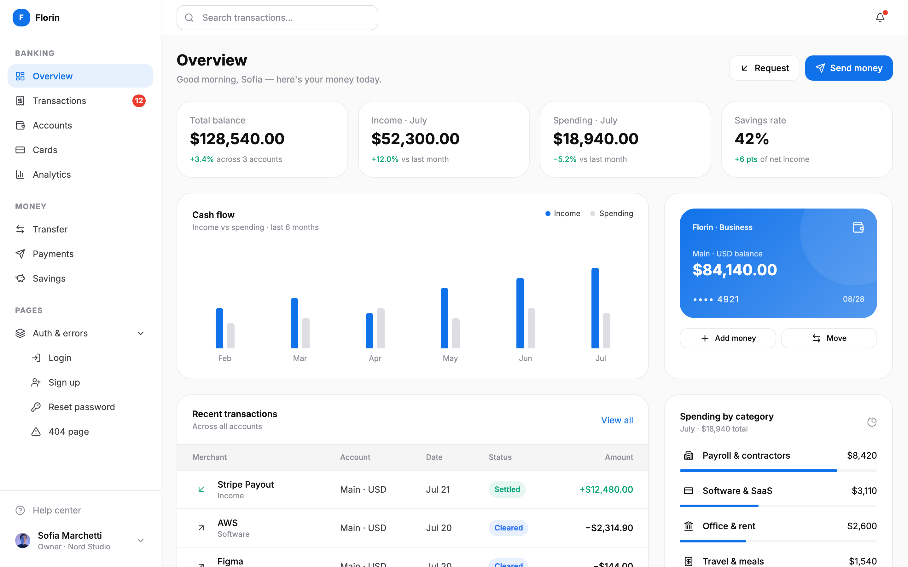
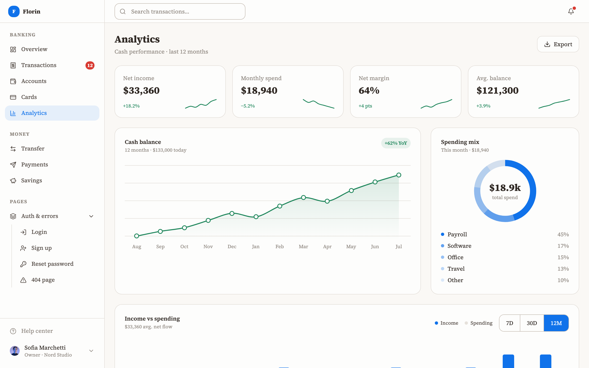
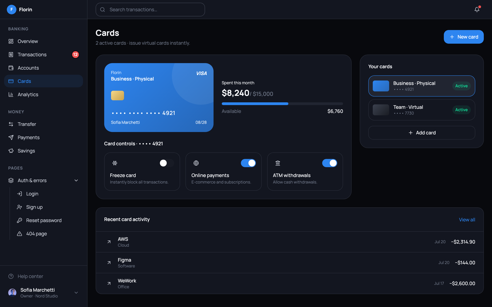
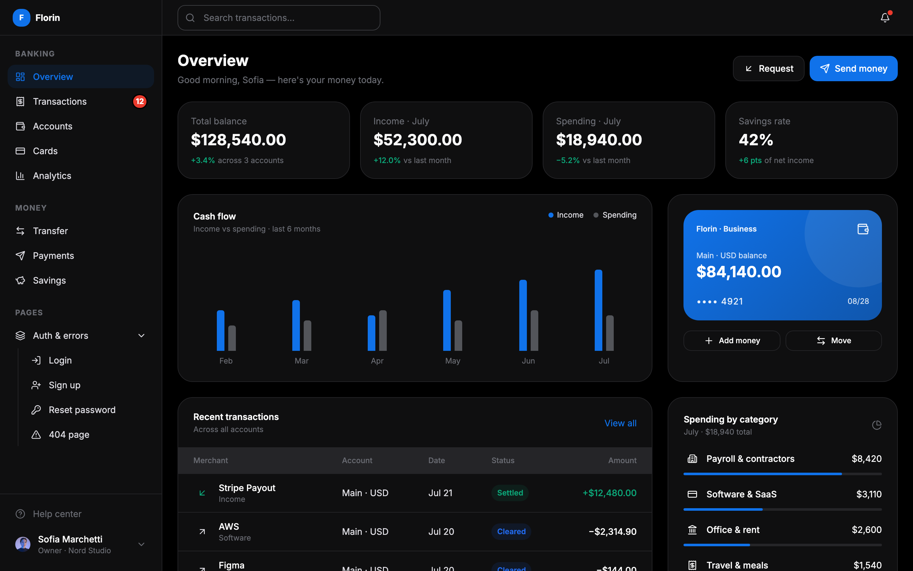

# Florin — free fintech dashboard template

**Florin** is a free, open-source **fintech / banking dashboard template**: 16 polished screens, live theme switching, dark mode, and zero UI-framework lock-in. Built with [Astro](https://astro.build) and [Veritheme](https://veritheme.com) — a pure-CSS design system with design tokens and a vanilla-JS behaviour bundle.



## Live re-theming

Every screen restyles itself instantly — fonts, radii, colors, dark mode — by switching a single `data-theme` attribute. No rebuild, no CSS-in-JS. The floating palette toolbar in the corner does it live.

| Editorial theme | Rounded Sans · dark |
| --- | --- |
|  |  |



## Screens

**Banking:** Overview · Transactions · Accounts · Cards · Analytics
**Money:** Transfer · Payments · Savings
**Account:** Settings · Billing · Notifications · Help center
**Auth & errors:** Login · Sign up · Reset password · 404

All screens share one responsive app shell (collapsible sidebar → off-canvas drawer on mobile), realistic data, working modals, filters, and charts — no dead buttons.

## Quick start

```bash
git clone https://github.com/tarasenko-by/florin.git
cd florin
npm install
npm run dev
```

Open `http://localhost:4321` — you land on the Overview screen.

```bash
npm run build     # static build to dist/
npm run preview   # serve the production build
```

## How it's built

- **[Astro](https://astro.build)** — every screen is a static `.astro` page; zero client-side framework.
- **[Veritheme](https://github.com/tarasenko-by/veritheme)** — all styling comes from the published npm package (`veritheme`): utility classes, components, design tokens, theme presets. There is no custom CSS beyond a [28-line file](src/styles/florin.css) for the off-canvas drawer.
- **Theming** — theme presets ship inside Veritheme's single CSS file and switch via `data-theme`; dark mode is a `.dark` class that follows the OS until the visitor picks explicitly.
- **Icons** — [Lucide](https://lucide.dev) via `@lucide/astro`.

## Use it as a starting point

Fork it, swap the fake data for your API, and keep the shell. Because styling is plain CSS classes on plain HTML, porting a screen to React, Vue, Svelte, or a server-rendered stack is copy-paste — there are no framework components to translate.

Want your own brand? Generate a theme on [veritheme.com](https://veritheme.com), drop the JSON/CSS in, and every screen follows.

## License

[MIT](LICENSE) — free for personal and commercial use.

---

Made by [Siarhei Tarasenka](https://github.com/tarasenko-by) · powered by [Veritheme](https://veritheme.com)
